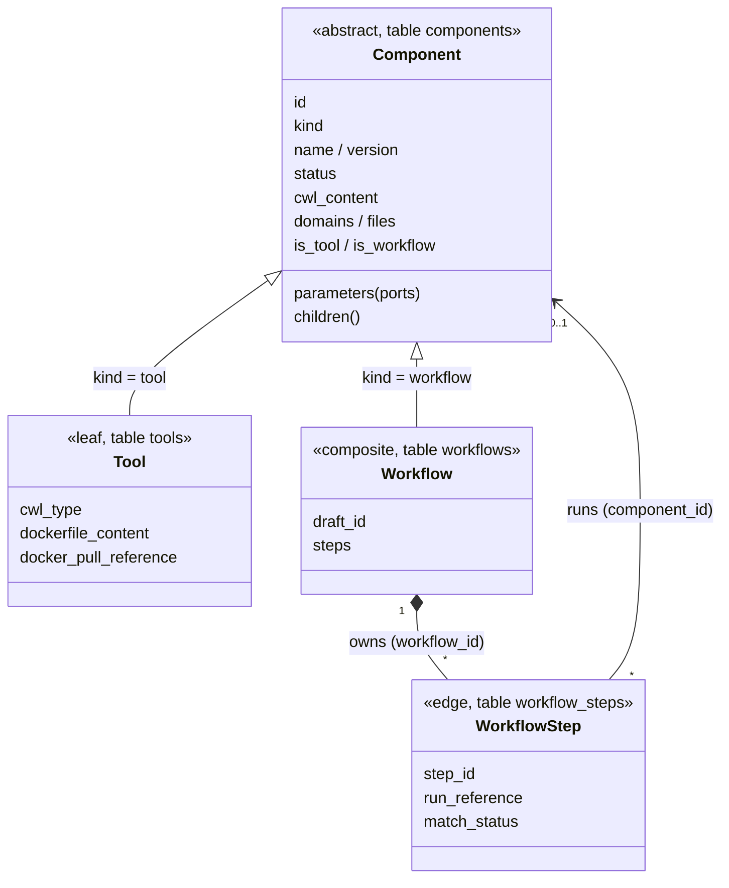
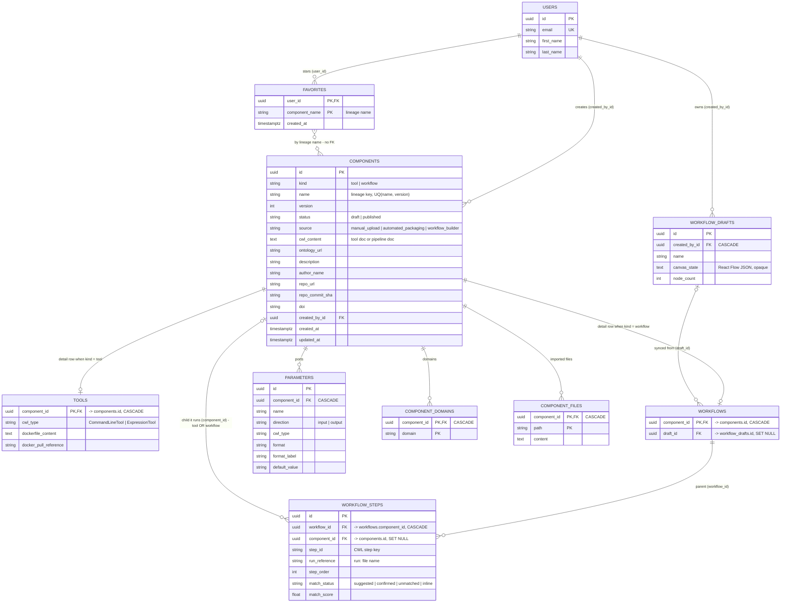

# Domain Model

How tools and workflows are stored as one composite. CWL makes `CommandLineTool`, `ExpressionTool` and `Workflow` all a `Process`. Here a **Component** is that abstract node, a **Tool** is a leaf, and a **Workflow** is a composite whose steps each run another Component: a tool, or (nested) another workflow.

## The composite



SQLModel cannot map a table class that subclasses another table class, so the hierarchy is not Python inheritance. Instead:

- `components` holds the fields both kinds share.
- `kind` says which kind a row is.
- `tools` and `workflows` are 1:1 detail rows that hold the rest.

In code, `component.tool` or `component.workflow` gives the kind-specific part; the other one is `None`.

## Tables



`login_codes` has nothing to do with components and is left out. Mermaid's ER notation cannot express "exactly one of `tools`/`workflows`, decided by `kind`". The services enforce that rule; the class diagram above shows it.

## Reading the tables

### One identity, two shapes

Every tool and every workflow is exactly one `components` row. Its kind-specific half lives in `tools` or `workflows`, keyed by the same id: `tools.component_id = components.id`.

### The recursion is the two foreign keys of `workflow_steps`

- **`workflow_id`** points up to the parent. It references `workflows`, so only a workflow can have steps.
- **`component_id`** points down to the child. It references `components`, so the child can be either kind. That one foreign key is what makes nesting possible:

```
components(kind=workflow)  "outer"
  └─ workflows
       └─ workflow_steps ── component_id ──► components(kind=tool)      "a"
       └─ workflow_steps ── component_id ──► components(kind=workflow)  "inner"
                                               └─ workflows
                                                    └─ workflow_steps ──► components(kind=tool) "b"
```

Binding a step rejects cycles by lineage name, so a workflow can never contain any version of itself. See `app/domain/composite/tree.py`, `would_create_cycle`.

### Everything shared hangs off the base row

Shared data is attached to `components`, so it behaves the same for both kinds:

- **Parameters.** A workflow's ports are its own inputs and outputs. They are what a parent wires to when it nests the workflow.
- **Domains, files, versions and status.** One code path serves both kinds.
- **Lineage name.** A lineage is every version sharing one `name`, and that name is unique across both kinds. Favorites and "used in" lookups use it.

### Deletes follow the arrows

- **Deleting a component** cascades to its `tools`/`workflows` row, parameters, domains and files. A workflow's own steps cascade with it.
- **Steps that ran the deleted component** keep existing, with `component_id = NULL`. Before the delete, `ComponentsService.detach` marks them `unmatched` and unpublishes their parent workflows.
- **Deleting a builder draft** leaves its synced workflows in place, with `draft_id = NULL`.

### Two links without a foreign key

- **`favorites.component_name`** points at a lineage name, which has no unique constraint of its own.
- **Builder drafts** reference components only inside the `canvas_state` JSON. That is why the deletion impact searches the canvas text.

## Loading the tree

Every relationship is `lazy="selectin"`. SQLAlchemy stops eager loading where a path revisits a relationship (component → workflow → steps → component), so a step's child would be left to a lazy load. An `AsyncSession` cannot do lazy loads; it raises `MissingGreenlet` instead.

`ComponentsRepository` therefore loads levels explicitly:

- **`find_by_id`** loads one level: the steps and the components they run.
- **`load_tree`** loads the whole tree below a component, one level per query. Use it for anything that recurses: publishing, downloading, cycle checks.

Code: `app/domain/models/`, `app/domain/composite/tree.py`, migration `alembic/versions/b8e2d4f7a913_composite_components.py`.
