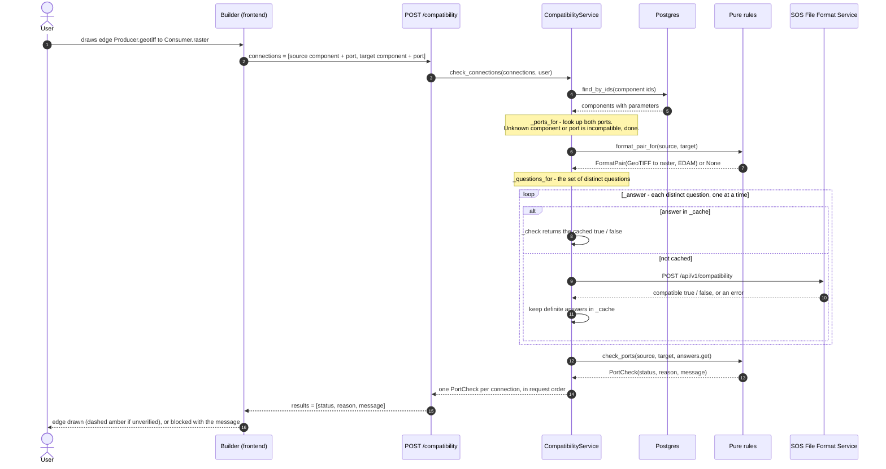
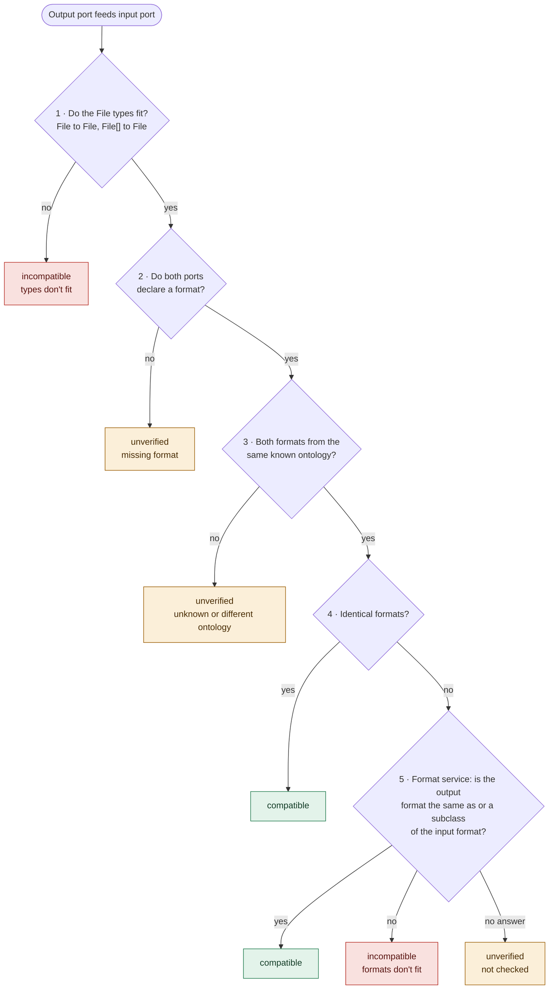
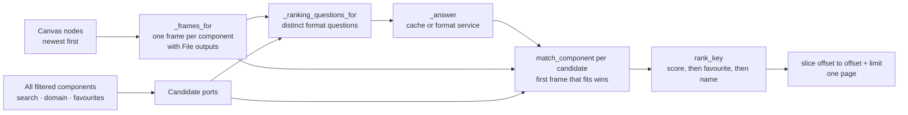

# Port Compatibility Check

How the backend decides whether an output port of one CWL component may feed an input port of another, and how the same pieces rank the component palette in the workflow builder.

## Three possible outcomes

| Status | Meaning | Builder behaviour |
|---|---|---|
| `compatible` | The file types fit, and the formats are identical or the format service confirmed them. | Edge is drawn normally. |
| `unverified` | The file types fit, but the formats can't be checked. | Edge is allowed, but drawn dashed amber with the reason. |
| `incompatible` | The file types don't fit, or the format service rejected the formats. | Connection is blocked, with the message as a toast. |

## Checking one connection

The rules in `app/domain/compatibility` are pure functions: they never call the format service themselves. `CompatibilityService` therefore works in two phases:

1. **Collect the questions and get the answers.** A *question* is a `FormatPair`: "in ontology Z, may a file of format X (the output) be used where format Y (the input) is expected?". The *answer* is `true`/`false` from the SOS File Format Service, or nothing if the service can't be reached.
2. **Decide.** It runs the rules, handing them the answers as a plain lookup (`answers.get`).

- A request carries a **list** of connections, so a restored canvas is checked in one call. Drawing a single edge sends a list of one.
- The questions are a **set**: five edges that all ask "GeoTIFF → raster?" produce one question.
- `_cache` lasts for the whole backend process. A format's place in an ontology doesn't change, so an answer stays valid. Only definite answers are stored, so a failed call is retried next time.
- Questions are asked one at a time on purpose. The format service caches a parsed ontology only once its first request completes, so parallel first requests would each download it again.
- Every `ontology_url` comes from a stored component (`Port.of`), never from the request, so the format service is only ever asked about ontologies that components here use.

## The decision order in `check_ports`

The steps run top to bottom, and the first one that applies decides. Only step 5 needs the format service; all the others are decided locally (`format_pair_for` returns `None` for them).

A port without a format means **unknown**, not "accepts anything". A MoveApps input that expects an `.rds` file has no ontology format, so a GeoJSON output only *might* fit it.

Ontology URLs are normalized when a component is saved (`infrastructure/format_service/ontology.py`). Every `edamontology.org` URL in `$schemas` maps to the one configured EDAM ontology (`FORMAT_SERVICE_EDAM_URL`), so components that name different EDAM releases can still be compared.

## Ranking the palette

`GET /components?rankAgainst=<id>&rankAgainst=<id>…` reuses the same pieces. Every canvas node becomes an **output frame**, newest first, and every candidate component is scored against the frames. All candidates are ranked **before** paging, so a good match on a later page still comes first.

**Score:** with *n* frames, a match in frame *i* (0 = newest) scores `2 · (n − i)`, minus 1 if the match is only unverified. A component without data inputs scores `−1` and sorts last. Ties are broken by favourites, then by name.

Ranking loads the whole filtered set per request. That's fine at this repository's size, and the format questions stay few: they're bounded by the number of distinct formats, and cached.

## Where it lives

| Path (under `app/`) | Role |
|---|---|
| `domain/compatibility/port.py` | `Port`, `FormatPair`, `FormatLookup`: the vocabulary of the rules. |
| `domain/compatibility/port_check.py` | `check_ports`, `format_pair_for`: the decision order above. |
| `domain/compatibility/ranking.py` | `match_component`, `rank_key`: palette scoring and order. |
| `domain/compatibility/format_label.py` | Which ports accept a hand-written label, and where a label came from. |
| `application/service/compatibility_service.py` | Loads the ports, collects the questions, answers them (`_answer`, `_check`, `_cache`), then applies the rules. |
| `infrastructure/format_service/` | HTTP client for the SOS File Format Service (it never raises; failures mean "no answer"), plus ontology URL normalization. |
| `api/routers/compatibility_router.py` | `POST /compatibility`: checks connections. |
| `api/routers/components_router.py` | `GET /components?rankAgainst=…`: the ranked palette. |

The rules are covered by `tests/domain/` (run with `make test`). The tests use a fake format service, so no running service or database is needed.
