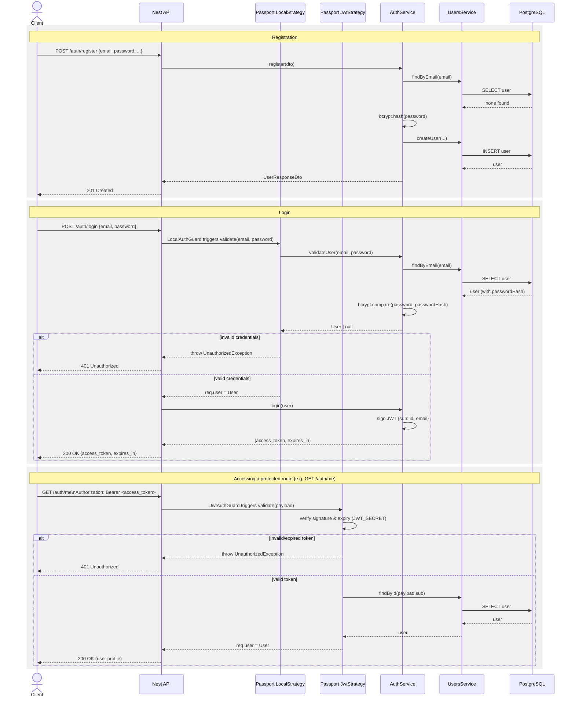

# Component Repository — Backend

NestJS REST API for storing and managing CWL-based workflow components. Components can be ingested automatically from a GitHub repository URL (via the `automated-packaging` CLI) or uploaded manually as a CWL file.

## Tech Stack

- **NestJS** with TypeScript
- **PostgreSQL** via TypeORM
- **Swagger / OpenAPI** at `/api`

## Prerequisites

- Node.js 22+
- Docker (for the database)
- Python packaging CLI set up in `../automated-packaging/` (required for `POST /components/package`)

## Setup

```bash
npm install
```

Copy the example environment file and adjust as needed:

```bash
cp .env.example .env
```

| Variable               | Default                                             | Description                              |
|------------------------|-----------------------------------------------------|------------------------------------------|
| `DATABASE_HOST`        | `localhost`                                         |                                          |
| `DATABASE_PORT`        | `5432`                                              |                                          |
| `DATABASE_USER`        | `moveapps`                                          |                                          |
| `DATABASE_PASSWORD`    | `moveapps`                                          |                                          |
| `DATABASE_NAME`        | `component_repository`                              |                                          |
| `PORT`                 | `3000`                                              | HTTP port the API listens on             |
| `PACKAGING_EXECUTABLE` | `../automated-packaging/.venv/bin/moveapps-cwl-package` | Path to the packaging CLI            |
| `GITHUB_TOKEN`         | _(empty)_                                           | Optional PAT to avoid GitHub rate limits |

## Running

**Start the database:**

```bash
docker compose up -d
```

**Run migrations:**

```bash
npm run migration:run
```

**Start the API:**

```bash
# Development (watch mode)
npm run start:dev

# Production
npm run build && npm run start:prod
```

The API is available at `http://localhost:3000`.  
Swagger UI is available at `http://localhost:3000/api`.

## API Endpoints

| Method | Path                    | Description                                      |
|--------|-------------------------|--------------------------------------------------|
| GET    | `/components`           | List all components (optional `?domain=` filter) |
| GET    | `/components/:id`       | Get a single component by ID                     |
| POST   | `/components/package`   | Package a MoveApps app from a GitHub repo URL    |
| POST   | `/components`           | Manually upload a CWL file as a component        |

### Domains

| Value               | Description          |
|---------------------|----------------------|
| `moveapps`          | MoveApps platform    |
| `earth_observation` | Earth observation    |

## Data Model

**Component**

| Field               | Type     | Description                               |
|---------------------|----------|-------------------------------------------|
| `id`                | UUID     | Primary key                               |
| `name`              | string   | Unique component name                     |
| `repoUrl`           | string?  | Source GitHub URL (auto-packaged only)    |
| `repoCommitSha`     | string?  | Commit SHA at packaging time              |
| `cwlContent`        | text     | Raw CWL file content                      |
| `dockerfileContent` | text     | Dockerfile content                        |
| `source`            | enum     | `moveapps` or `manual`                    |
| `domain`            | enum     | `moveapps` or `earth_observation`         |
| `parameters`        | array    | Extracted CWL input parameters            |
| `createdAt`         | datetime |                                           |
| `updatedAt`         | datetime |                                           |

**Parameter** (extracted from CWL `inputs`)

| Field          | Type    | Description                        |
|----------------|---------|------------------------------------|
| `id`           | UUID    |                                    |
| `name`         | string  | Parameter name from CWL            |
| `cwlType`      | string  | CWL type (e.g. `string`, `File`)   |
| `defaultValue` | string? | Default value if specified in CWL  |
| `description`  | string? | `doc` field from CWL               |
| `direction`    | enum    | `input` (outputs not yet modelled) |

## Authentication

Authentication is self-contained (no external identity provider) and implemented with **Passport**:

- **`local` strategy** — validates `email`/`password` against the `users` table (bcrypt-hashed password) during login.
- **`jwt` strategy** — validates the `Authorization: Bearer <token>` header on protected routes and loads the corresponding user.

Passwords are hashed with `bcrypt` before being stored. On successful login, a signed JWT (`JWT_SECRET`, expiry `JWT_EXPIRES_IN`) containing the user's `id` and `email` is issued and must be sent as a Bearer token on subsequent requests.



## Database Migrations

```bash
# Generate a new migration after entity changes
npm run migration:generate

# Apply pending migrations
npm run migration:run

# Revert the last migration
npm run migration:revert
```
